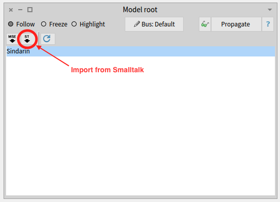
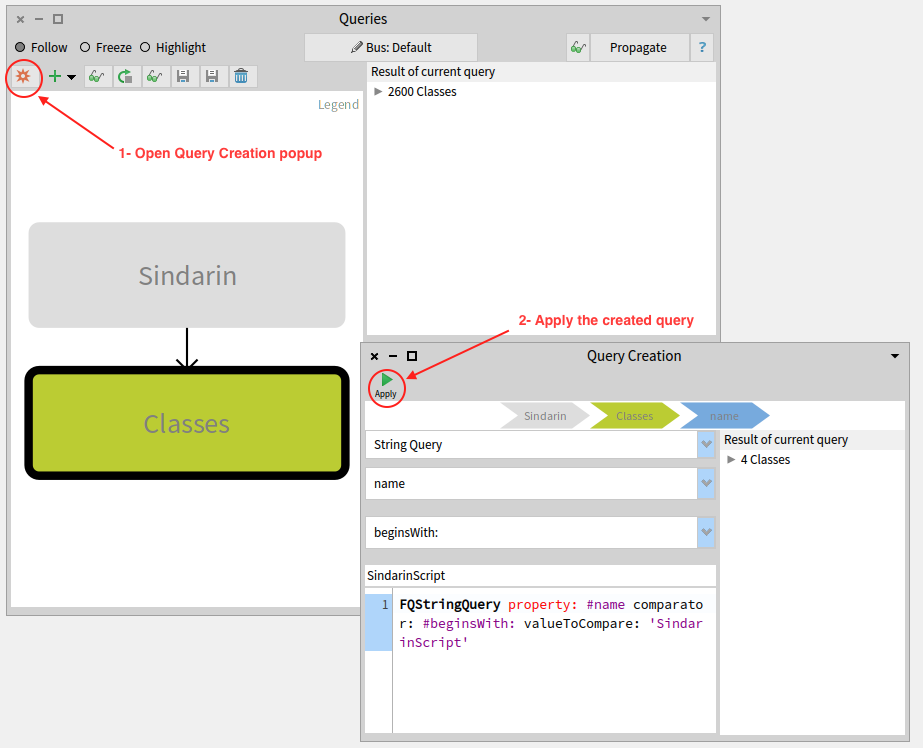
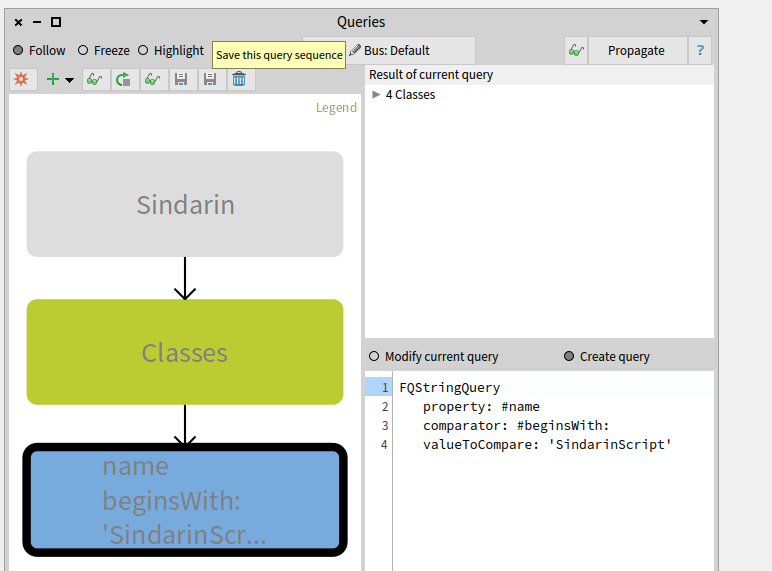
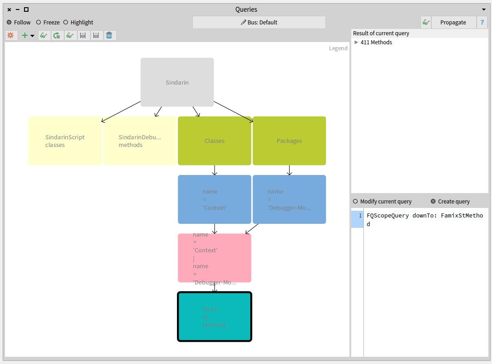
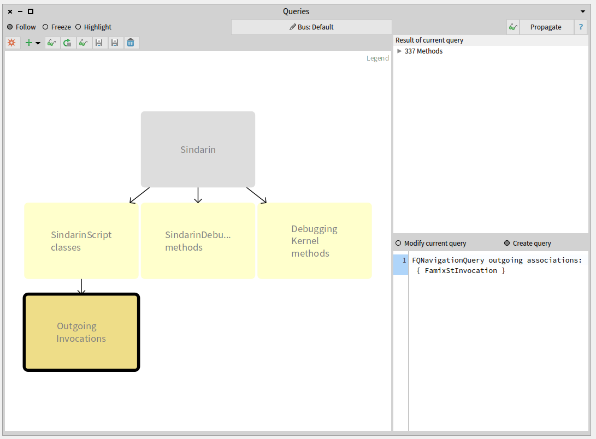
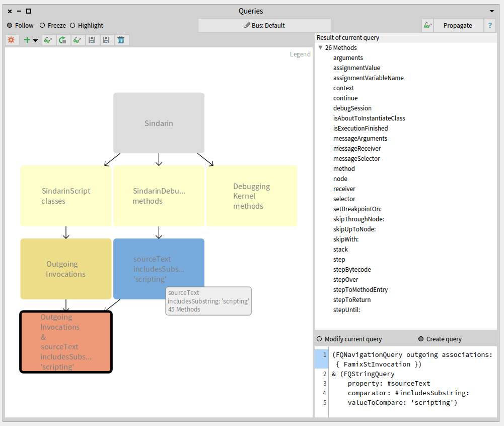
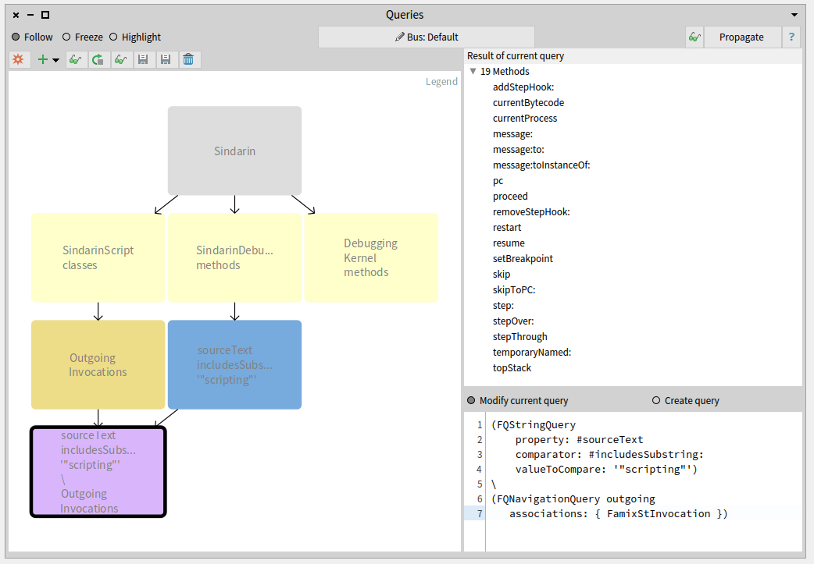
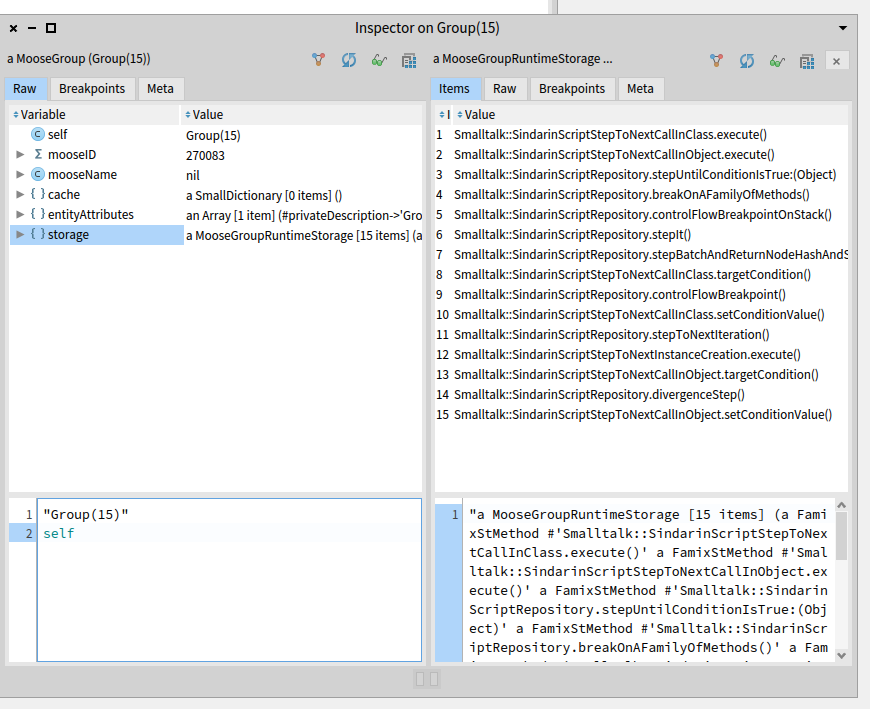

# Introduction

How is our API used? This is the question the Pharo debugging team came to me with. They needed to know if it is used as they intended to or if there are some improvements to do.
To answer that question, we used some of Moose new browsers.

# Context

## Sindarin API

The Pharo debugging team works on Sindarin, an API that eases the expression and automation of debugging tasks.
Sindarin is made of two layers:

- The "technical" API is the minimal API needed to interact with a debugging kernel (the Pharo kernel here).
- The "scripting" API is here to ease the writing of debugging scripts without having to manipulate low-level concepts.


Now, that's the theory.
In reality, the debugging team realized that these two layers are not really respected: users bypass the scripting API to use technical methods and the debugging kernel methods directly.
We used Moose to analyze Sindarin API usage, to help understand if, and how, it should be improved.

## Modular Moose

Moose has recently been upgraded and now offers more modularity.
Users can analyze their model through new specialized browsers that allow users to navigate and visualize their model entities.
Entities are propagated from one browser to the others, dynamically updating their contents.

Helping the debugging team was an opportunity to test some of these browsers under operating conditions.

# Analysis of the interactions of the users scripts with Sindarin and with the debugging kernel

To analyze Sindarin, we built a model constituted of 3 key elements:

- Users debugging scripts: script methods gathered in 4 Classes (green in the figure above)
- Sindarin: methods from the `SindarinDebugger` class (both APIs, yellow and blue in the figure)
- Pharo debugging kernel (pink in the figure)

Our goal was to understand how the users' scripts use Sindarin and if they interact directly with the debugging kernel.

## Importing the model

We imported the model directly from Pharo, using the Model Root browser.
This browser is the entry point to modular Moose.
It shows the list of installed models and allows to import new ones from MSE files or from Pharo.



Once the model was imported, it was automatically propagated in modular Moose, to other browsers.

## Querying the model to select key elements from the model

To explore the debugging scripts, Sindarin and the debugger kernel - and the interactions between them - we used the Query browser.

### The Query browser

The purpose of this browser is to query a model or a group of entities.
It can filter entities according to their type or the value of their properties.
It can also use [MooseQuery](https://moosequery.ferlicot.fr/) to navigate associations (inheritances, invocations, accesses, and references) and scopes (containment).


The left pane of the browser is a visualization of the queries that were made.
On the image above, no queries were made yet. The left pane only shows the model on which queries will apply.
The right pane of the browser shows the result of the selected query and the code used to build it.

### Querying the key elements from the model

We obtained the 3 elements relevant to our analysis (users scripts, Sindarin, and the debugger kernel) by combining simple queries:

##### Queries to get the users scripts:

- A Type query (`Classes`) gave us all the classes in the model, then
- a property query (`name beginsWith: 'SindarinScript'`) gave us the 4 scripts classes.

The two images below show how this last query was constructed:





##### Queries to get Sindarin API, i.e. methods of the class SindarinDebugger:

- A type query (`Classes`), gave us all classes in the model, then
- a property query (`name = 'SindarinDebugger`'), gave us the Sindarin API class.
- finally, a scope query (`scope down to methods`) gave us all Sindarin methods, *i.e.* the API.

##### Queries to get methods from the debugging kernel:

The image below shows the sequence of queries created to obtain methods from the Context class and the Debugger-Model package:

- Two Type queries (`Classes` and `Packages`, green on right), gave us all classes and packages in the model, then
- two property queries (`name = 'Context'` and `name = 'Debbuger-Model'`, blue), gave us the Context class and the Debugger-Model package, then
- we made the `union` (pink) of the class and package, and finally
- a scope query (`scope down to methods`, turquoise, bottom right query) gave us the methods they contain.



#### Saving queries combinations as custom queries

We saved these combinations of simple queries as custom queries, as shown in the image below:

- **SindarinScript classes** are the 4 script classes.
- **SindarinDebugger methods** are the Sindarin API, *i.e.* methods from SindarinDebugger class
- **Debugger Kernel methods** are methods from the debugging kernel, that should not be called directly from the scripts.


## How do scripts interact with Sindarin and the debugging kernel?

We added a navigation query to obtain methods that were called in the script. We then narrowed this result by selecting methods from Sindarin or from the debugging kernel.

#### All methods invoked in the scripts

To find which methods are called in the users scripts, we queried **outgoing invocations** from the scripts classes.
We obtained a group of 331 candidate methods whose signatures match messages sent in the scripts:



#### Sindarin methods called from the scripts

The next step was to compare this group of candidates with the methods from Sindarin scripting API.
We established with the debugging team that scripting methods should have `"scripting"` as comment.
This convention allowed us to get them with a property query (blue query in the figure below).

We queried for the **intersection** between the scripting API and the group of candidates invoked from the users scripts (salmon query at the bottom left in the figure below).
This gave us 26 methods that are called from the scripts, out of 45 in the Sindarin scripting API:

These 26 mehtods, result of the last query performed, are listed in the top right pane of the Query browser.



#### Sindarin methods that are not used in the scripts

It was important for the debugging team to know the other 19 scripting API methods that are **not** called from the scripts.
We obtained them by querying the **difference** between Sindarin methods and the group of candidates (purple query at the bottom left in the figure below):



Again the 19 resulting methods are listed in the "Result" pane.

The debugging team now knows which methods from their scripting API have been useful for users and, most importantly, which methods have not.

#### Debugging kernel methods called from the scripts

We also compared the group of candidates invoked from the users scripts with the methods of the debugging kernel and obtained 15 methods. These methods are  used directly in the users scripts without using Sindarin:


## Identifying the scripts that use the debugging kernel:

Let's get back to the fact that outgoing invocations gave us a group of **candidates** methods.
When several methods share the same signature, we cannot know for certain which method is called.

For example: Sindarin defines `#arguments`, which is also defined in `Context`.

Sindarin defines:

```smalltalk
arguments
  ^ self context arguments
  ```

that should be used as follows:

```smalltalk
sindarin := SindarinDebugger new.
"some steps"
(sindarin arguments at: 1) doSomething.
```

We wanted to detect cases where the users did not use Sindarin, like in the following:

```smalltalk
sindarin := SindarinDebugger new.
"some steps"
(sindarin context arguments at: 1) doSomething.
```

This is a simple example or wrong practice.
In more complex cases, interacting directly with the kernel would force the user to write verbose scripts and increase the risk of bugs. Why not benefit from a tested API when you can ?

To detect these cases, we used a convention of the users scripts: each time a call to Sindarin API is made, the receiver is a variable named `sindarin`.
This means that invocations which receiver is not `sindarin` are probably cases where the user bypassed Sindarin API, calling the debugging kernel directly.

We inspected the 15 debugging kernel methods that may be used directly in the scripts and selected the ones that are sent from the scripts to a receiver other than `sindarin`.
This was done in Pharo (not the Query browser), using [MooseQuery](https://moosequery.ferlicot.fr/):

```smalltalk
self select: [ :method |
	method incomingInvocations anySatisfy: [ :invocation |
		(invocation sender parentType name beginsWith: 'SindarinScript')
			and: [ invocation receiver isNil
				or: [ invocation receiver name ~= 'sindarin' ] ] ] ]
```

We narrowed it down to 11 methods of the debugging kernel that are called from the scripts:


We then collected the scripts where these methods are called:

```smalltalk
self flatCollectAsSet: [ :method |
	method incomingInvocations
		select: [ :invocation |
			(invocation sender parentType name beginsWith: 'SindarinScript')
				and: [ invocation receiver isNil
					or: [ invocation receiver name ~= 'sindarin' ] ] ]
		thenCollect: #sender ]
```

We obtain 15 user script methods that need to be investigated manually. Moose cannot determine which object will receive a message when the script is executed. The debugging team will analyze in the scripts the statements where the probable kernel methods are invoked. They will run the debugging scripts to identify at runtime which objects are the receivers.

Exploring these 15 scripts will help the debugging team to understand whether:

- Users did not use Sindarin correctly: they interacted directly with the debugging Kernel, even though Sindarin methods are available,
- Sindarin API is incomplete: users had no choice but to interact with the debugging kernel because Sindarin does not provide the necessary methods,
- There are other reasons why the API is not used correctly?



# Query browser improvements

With this experiment, we were able to provide valuable information to the debugging team.
In return, we got suggestions of improvements to be implemented in modular Moose tools.

To know how many times a method is called, we need the number of invocations of this method.
That is querying the *size* of a query result.
The query browser does not allow it yet, and it should.

To get the 15 users scripts that need to be explored, we had to inspect a group of methods and run a selection manually (Pharo code).
This should be possible directly in the queries browser: users should be able to build a query that executes a query script.

# To be continued ...

This experiment will help Pharo debugging team to improve Sindarin.
They will be able to make it more complete and documented, so users continue to develop debugging scripts.

In the meantime, we will improve modular Moose to widen the queries possibilities.
Then, we will challenge these new features: we will use them to analyze the upgraded Sindarin API to document its evolution.
