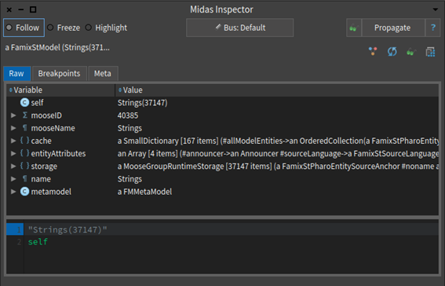
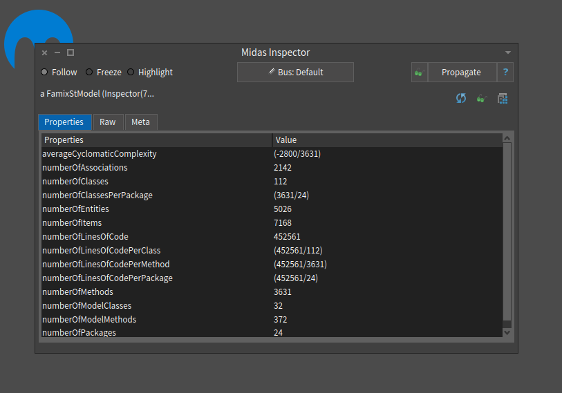

## How to build a new Moose tool: The MooseInspector

To create a new Moose Tool, you must create a child class of `MiAbstractBrowser`. This abstract class contains the basic infrastructure to all Moose browsers. It provides a toolbar with: buttons to inspect and propagate the current selection; Radio buttons to choose a reception mode; and a help button that shows the class comment for each browser.


Also, it provides the logic to connect the browser to the Moose bus.

So, let us get started. We will create a “Moose Inspector”. It would be like the Pharo’s inspector but as a Moose browser. Firstly, we create the subclass as following:

```smalltalk
MiAbstractBrowser subclass: #MiInspectorBrowser
    instanceVariableNames: 'stInspector'
    classVariableNames: ''
    package: 'Moose-Core-Inspector'
```

As one can see, it has one instance variable which will hold an instance of Pharo’s inspector: `StInspector`.

Now, we must implement some basic methods. First let us implement `initializePresenters` method:

```smalltalk
initializePresenters

    super initializePresenters.
    stInspector := self instantiate: StInspector.
    stInspector model: self model
```

We instantiate stInspector variable an instance of Pharo’s inspector. Then we set the inspector model to be the same as the browser model.

Now we are going to implement `canReceiveEntity:` method. This method returns a Boolean which tells us if the entities received on the bus are usable in this browser. As we are building an inspector all entities can be accepted. So, we are going to return true always.

```smalltalk
canReceiveEntity: anEntity

    ^ true
```

Then, we must implement `followEntity:` method. This method is called when new entities are received from the bus. In this case, we only need update the inspector model with the new entity. This method has the responsibility of defining the behaviour of the browser when new entities arrives from the bus. This is part of the bus mechanism of `MiAbstractBrowser`. This method is called if `canReceiveEntity: anEntity` returns true.


```smalltalk
followEntity: anEntity

    self model: anEntity.
    stInspector model: self model
```

Next, the `miSelectedItem` method tells the bus what to propagate (when the user hits the “Propagate” button). In this case we want to propagate the object selected in the last inspector page.

```smalltalk
miSelectedItem

    | lastInspectorPage |
    lastInspectorPage := stInspector millerList pages last.
    ^ lastInspectorPage model inspectedObject
```

Now we have all the logic and we can define the layout of this new browser. Now in Spec, the framework used to buld GUi in Pharo, we can implement dynamic layouts. So, we create a `initializeLayout` method. In that method, we take the layout of the super class, which is the toolbar, and we will add the other presenter.

```smalltalk
initializeLayout

	self layout: (SpBoxLayout newTopToBottom
		add: self class defaultSpec expand: false;
		add: stInspector;
		yourself)
```

And do not forget to call this at the end of `initializePresenters`.

```smalltalk
initializePresenters

    super initializePresenters.
    stInspector := self instantiate: StInspector.
    stInspector model: self model.
    self initializeLayout
```

Finally, we can define which will be the default model on which the browser will open. This is in case the bus does not have any entities. We want the Moose models, so create on class side:

```smalltalk
newModel

    ^ MooseModel root entities
```

Optionally, we can override class side methods `title` and `windowSize`.
We are ready to go. All we must do now is to run `MiInspectorBrowser open` on a Playground. This will open our new browser.



**How to add new tabs in the Moose Inspector Browser**

The new browser is not effective yet. We want to add some custom tabs to inspect the entities in a more visual way. To do so we can add some custom inspector tabs. When it displays an object, the inspector looks for methods of that object that have the `<inspectorPresentationOrder:title:>` pragma. The method should return a spec presenter that will be included in the inspector’s tab.

We will migrate the old “Properties” tab that is found in `MooseFinder`. The code is in `MooseObject>>#mooseFinderPropertiesIn:` We only have to rewrite it using Spec framework and use the pragma `<inspectorPresentationOrder:title:>`. We will create a method in MooseObject called `inspectorPropertiesIn`.

```smalltalk
inspectorPropertiesIn

    <inspectorPresentationOrder: 2 title: 'Properties'>
    ^ SpTablePresenter new
        items: self mooseInterestingEntity mooseDescription allPrimitiveProperties;
        sortingBlock: [ :x :y | x name < y name ];
        addColumn: (SpStringTableColumn title: 'Properties' evaluated: #name);
        addColumn: (SpStringTableColumn title: 'Value' evaluated: [ :each | (self mooseInterestingEntity mmGetProperty: each) asString ]);
        yourself
```

Because the method is defined in `MooseObject`, any subclass (MooseModel, MooseEntity, …) will have this tab when displayed in the inspector.

That it is! Now we run again: `MiInspectorBrowser open` and we will se that the new tab now appears.


