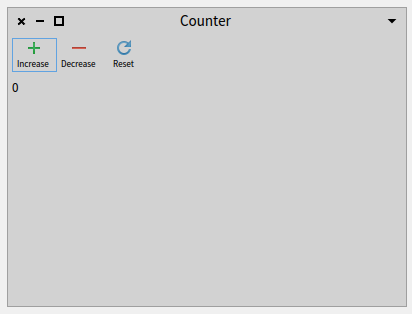

# How to build a toobar with Spec

Let's build a simple presenter showing a counter. To manage this counter, we will build a toolbar which buttons increase, decrease or reset the value of this counter.



Our presenter is implemented in `CounterPresenter`, a subclass of `SpPresenter`. It will define 3 methods to manage the counter value: `#increaseCounter`, `#decreaseCounter` and `#resetCounter`.
We will not consider the building of the presenter itself but we will focus on the toolbar.

## Simple version: build a toolbar manually

Spec provides an API to build toolbars and add dedicated buttons in it.
We will use it in the presenter initialization method: `#initializePresenters`, overriden from `SpPresenter`, to instantiate a toolbar:

```smalltalk
toolbar := self newToolbar
```

Then, we manually build toolbar buttons and add them into the toolbar:

```smalltalk
    toolbar
        add: (SpToolbarButtonPresenter new
            label: 'Increase';
            icon: (self iconNamed: #smallAdd);
            action: [ self increaseCounter ]);
        add: (SpToolbarButtonPresenter new
            label: 'Decrease';
            icon: (self iconNamed: #remotesManagerRemoveRemote);
            action: [ self decreaseCounter ]);
        add: (SpToolbarButtonPresenter new
            label: 'Reset';
            icon: (self iconNamed: #smallUpdate);
            action: [ self resetCounter ]).
```

We also need to add the toolbar to the presenter layout. Since Pharo 10, we can do this instance side:

```smalltalk
    intializeLayout

        self layout: SpBoxLayout newTopToBottom
            add: toolbar height: self class toolbarHeight;
            "... other widgets ...";
            yourself
```

This version works perfectly. However, the definition of the buttons, their actions, labels and icons are only defined locally and are not easy to reuse. We will extract this behavior to Commands and use them to build our toolbar.

## Reify actions: Commands

### Extract our buttons behavior to Commands

We use Commander, the implementation of the Command pattern in Pharo.
Let's create 3 subclasses of CmCommand, one for each of our buttons. These classses define an instance variable `#context`. In this case, it will be our presenter.

Each class should define the `#execute` method according to its expected behavior:

```smalltalk
execute

    self context increaseCounter
```

Our commands should also implement the class methods `#defaultTitle`, and `#defaultIconName`.

```smalltalk
defaultTitle

    ^ 'Increase'
```

```smalltalk
defaultIconName

    ^ #smallAdd
```

### Use commands in Spec

To be used in Spec, our commands are decorated as SpCommands via the method `#asSpecCommand`.
We override this method to correctly use the icon name, as follows:

```smalltalk
asSpecCommand

    ^ super asSpecCommand
        iconName: self class defaultIconName;
        yourself
```

### Convert commands to toolbar buttons

SpCommand provides an API to be converted as buttons in spec.
A first way to do it is to directly add them in the toolbar. Here is a second version of the `#initializePresenters` method:

```smalltalk
    toolbar
        add: (IncreaseCounterCommand forSpecContext: self) buildPresenter;
        add: (DecreaseCounterCommand forSpecContext: self) buildPresenter;
        add: (ResetCounterCommand forSpecContext: self) buildPresenter.
```

Here, we give the presenter as context for the commands before building each button.

At this step, we have a functional toolbar using built with commands. We can still improve this by using commands groups

## Command groups

Spec presenters can define commands groups to be used in toolbars and menus via the class method `#buildCommandsGroupWith:forRoot:`.
We implement it in our presenter, on class side:

```smalltalk
buildCommandsGroupWith: aPresenter forRoot: aRootCommandGroup

    aRootCommandGroup
        register: (IncreaseCounterCommand forSpecContext: aPresenter);
        register: (DecreaseCounterCommand forSpecContext: aPresenter);
        register: (ResetCounterCommand forSpecContext: aPresenter)
```

To get this command group, SpPresenter implements `#rootCommandsGroup`. This method collects the commands defined in `#buildCommandsGroupWith:forRoot:` and set the current presenter as their context. We call it in the `#initializePresenters` method.

```smalltalk
toolbar fillWith: self rootCommandsGroup.
```

:warning: Be careful, `#fillWith:` will remove all items already present in the toolbar. In this code snippet, `aButton` will not be in the toolbar:

```smalltalk
toolbar
  add: aButton; "Will be removed by next line"
  fillWith: aCommandGroup.
```

## Use window toolbar

Instead of defining a toolbar as a subpresenter, it is a good practice to define the toolbar in the window directly.
We remove the `toolbar` instance variable and all the related code in `#initializePresenters` and `#initializeLayout`.
We then override `#initializeWindow:` from `SpPresenter`.

```smalltalk
initializeWindow: aMiWindowPresenter

    super initializeWindow: aMiWindowPresenter.
    aMiWindowPresenter toolbar:
        (SpToolbarPresenter new fillWith: self rootCommandsGroup)
```

## Conclusion

Building toolbars in Spec can be done manually. However, by using commands, we separate responsibilities and we can re-use, extend and test these commands. The commands our presenter builds can be used not only in toolbars, but also in menus in a similar manner.
