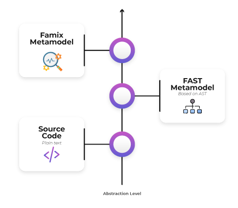
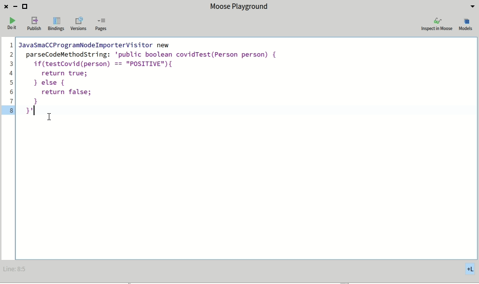

## Introduction

When we are interested in the migration/modernization of projects we are using models of the project and their meta-models. Moose revolves around a powerful Famix meta-model that allows us to do several operations. For instance, previous posts present how to [analyze and query a model](/blog/2021-03-30-modularmoose-usecase), [visualize a model with plantUML](/blog/2021-06-04-plantUML-for-metamodel), or [create a model](/blog/2021-02-04-coasters), etc.

FAST is a meta-model that helps us understand source code in a less abstract way. Indeed, FAST is based on AST (Abstract Syntax Tree) which is close to the source code. And as the devil is in the details, FAST contains interesting elements when analyzing programs (for example some specific expression or statement), and effectively this is what makes the difference between FAST and Famix.
(Consult this [overview](/developers/Parsers/FAST) about the FAST model).



In this blog post we will explain how to load FAST Java and generate a FAST model of Java code. For this we will take [ArgoUML](https://en.wikipedia.org/wiki/ArgoUML), an open-source Java project, as an example.

## Overview & Prerequisites

First of all, we have to understand from where we are going to start and where we are going to end up. As already mentioned, we will take the AgroUML’s java code and the goal is to generate the corresponding AST and do analyses on it. To do this, 3 steps are necessary to have the AST as illustrated in the figure below:

1. Parse Java to build a Famix model
2. Load the model into Moose
3. Generate the AST


Before starting, we must download [the source code](/assets/files/ArgoUML-0.34.zip) and [the Famix model](/assets/files/ArgoUML-0-34.json) of the ArgoUML project, step 1 of the diagram above (follow this [blog](https://fuhrmanator.github.io/2019/07/29/AnalyzingJavaWithMoose.html) for more details).

## Configuration

Now, we will import the Famix model from the `ArgoUML-0-34.json` file in the Models Browser. Then, we should know that the FAST meta-model is specific to a gien programming language, i.e for Pharo code we need FAST for Pharo, for X language code we need the FAST meta-model for the X language. Right now, there are two FAST meta-models: FAST Java and FAST Pharo.

In the following, we will generate the AST of a class (or method) for Pharo/Java code in three different ways: directly from some source code, from a method in Pharo, or from a Famix entity.

### FAST Installation

To install FAST Java you can run the following script on Moose Playground:

```smalltalk
Metacello new
    githubUser: 'moosetechnology' project: 'FAST-JAVA' commitish: 'v3' path: 'src';
    baseline: 'FASTJava';
    load: 'all'
```

To install FAST Pharo use the following script:

```smalltalk
Metacello new
baseline: 'FASTPharo';
repository: 'github://moosetechnology/FAST-Pharo:v2/src';
load: 'importer'.
```

### Java code as string

In this case, we will use a specialized importer "FAST-Java importer" to import the AST from a method source code. The complete code of the method to import is between single quote (_i.e._ a Pharo string) in the following code:

```smalltalk
JavaSmaCCProgramNodeImporterVisitor new
  parseCodeMethodString: 'public boolean covidTest(Person person) {
    if(testCovid(person) == "POSITIVE"){
      return true;
    } else {
      return false;
    }
  }'
```

### Pharo class or method

The following script imports the method #collect: of Collection :

```smalltalk
FASTSmalltalkImporterVisitor new
  runWithSource: (Collection >> #collect:) sourceCode
```

### Generate FastJava model

In this section, we will not proceed as above. Instead, we start from a class/method of the Famix Java model and we will load its FAST representation.

We will add the model to the Playground


We got this:

```smalltalk
argoUML034 := MooseModel root at: 1.
```

We pick any model class from the model:

```smalltalk
class := argoUML034 allModelClasses anyOne.
```

And finally we generate the AST using generateFastJava:

```smalltalk
class generateFastJava
```

## Navigating Through AST

One nice way to explore a FAST model is to use the source code and the tree extensions of the inspector. It allows one to navigate in a FAST model and see the code corresponding to each node.

To use it, we start from the Java model loaded above. Then, we select a model method entity. On the right-hand pane of the inspector, select the Tree tab, on the left-hand pane, select the source code extension. The source code is highlighted and the area selected corresponds to the entity selected in the right-hand panel. ( from [FAST-Pharo article](/developers/Parsers/FAST-Pharo) )



## Conclusion

In this post, we saw how to load the AST of a Pharo/Java model using FAST. The FAST model is useful when we need to understand more details about our model (for example identifiers, expression statements .. etc) which are not provided by Famix.
