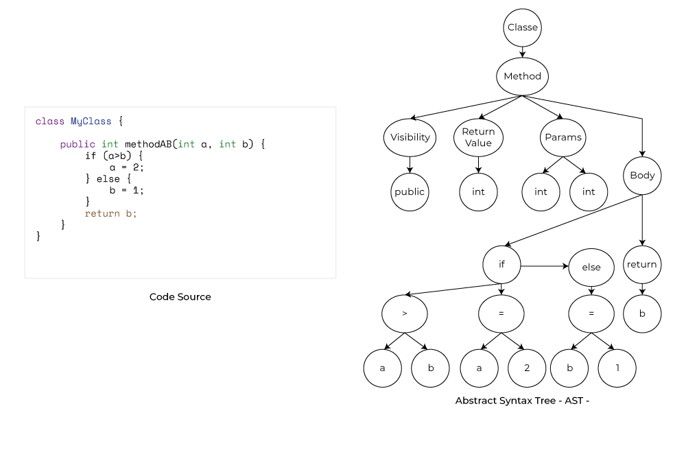
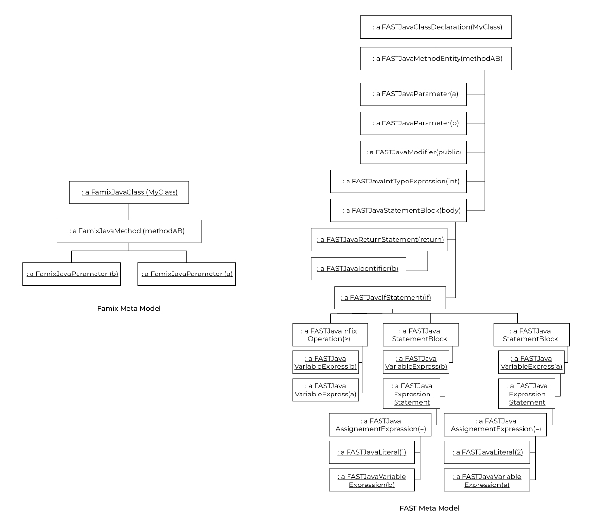
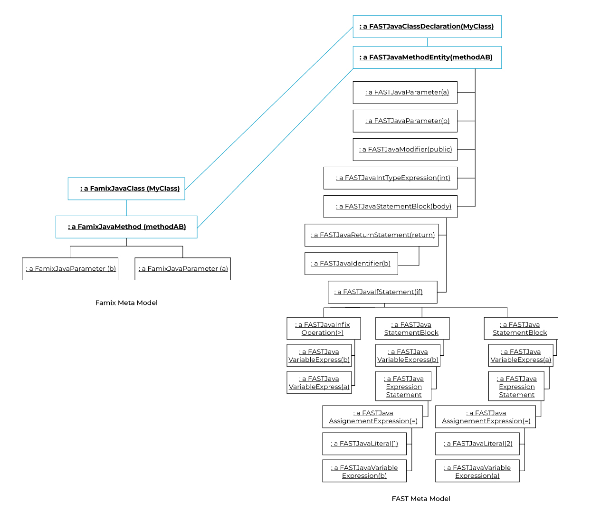
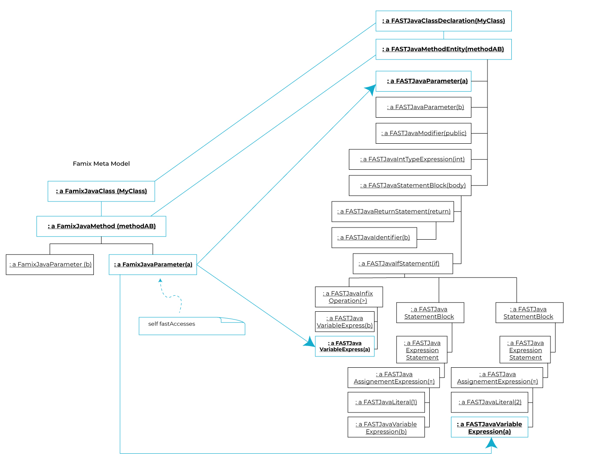

## Introduction

To analyze software systems, the Famix meta-model provides enough abstraction to understand how models work.

However, when we are interested in details, the FAST (Famix AST) meta-model provides less abstraction and gives us more information about our model (for example expression statements, identifiers _etc._).

In some situations, such as modernization/migration projects, we need the binding between the two meta models. And here Carrefour comes in!


Carrefour represents a two-way link between Famix and FAST, it allows one to navigate on the AST and at the same time return to the elements of FAMIX when needed.

## Configuration

In this blog, we are going to use a simple snippet of code to simplify and grasp all necessary concepts we should know about FAST & Carrefour & Famix.
Consider the `MyClass` class and the following `methodAB` method:

```smalltalk
class MyClass {
  public int methodAB(int a, int b){
    if (a > b) {
      a = a + 2;
    } else {
      b = 1;
    }
    return b;
  }
}
```

Let's prepare the ground for using Carrefour by generating the Famix model of the MyClass class using [VerveineJ](/developers/Parsers/VerveineJ).
Open a code editor and create a new `MyClass.java` file.
Inside the Java file, we add the code above.

To generate the Famix Java model we use VerveineJ by running this command in the `MyClass` java file directory:

```sh
/path/to/VerveineJ/verveinej.sh -format json -o MyClass.json -anchor assoc -autocp ./ ./
```

> PS: Note that Carrefour uses entities & associations as source anchor information, so make sure to add the option `-anchor assoc`.

### Load Carrefour

In this section, we start from the MyClass Famix java model and we build the link between Famix and FAST using Carrefour.
First, we need to install Carrefour, for example by running the following script on Moose Playground:

```smalltalk
Metacello new
    githubUser: 'badetitou' project: 'Carrefour' commitish: 'v3' path: 'src';
    baseline: 'Carrefour';
    load
```

Then we import the MyClass model and pick the first class (which is the only class MyClass).

```smalltalk
'/path/to/MyClass.json' asFileReference readStreamDo: [ :stream |
    model := FamixJavaModel new importFromJSONStream: stream
  ].
model rootFolder: '/path/to/MyClass/Directory/'.
method := model allModelClasses first.
```

Now, we call Carrefour to generate the AST (the figure below) and bind the newly created AST with Famix.

```smalltalk
method generateFastAndBind
```



> it’s recommended to use `generateFastIfNotDoneAndBind` instead of `generateFastAndBind` in complex project and heavy computation when generating AST

## Bidirectional binding

To have a complete vision of the meta-models described above, we give the corresponding figures of each meta-model FAST and FAMIX:



Once Carrefour has been called and the binding is done, we will have the first links between the meta-models as follows:



### From FAST to Famix

As an example, for the condition level variable (`a>b`) in FAST we would want its correspondence in FAMIX.
To do this, we send the `#famixVariable` message to the `FASTJavaVariableExpression` object and we get as returned value the corresponding FAMIX variable.


### From Famix to FAST

Now we go in the opposite direction, we will access all the matches of the FAMIX variable `a` in the FAST meta-model.

To do so, we use the `#fastAccesses` message as in the figure:



Carrefour also provides the `#fastDeclaration` API to get where a Famix variable has been declared at the FAST meta-model level.

## Conclusion

In conclusion, Carrefour allows us to go back and forth between FAST and FAMIX meta-models.
The example used in the blog post is not complex but allowed us to see how to navigate between the two meta-models.
In large projects, where there are more initialization, invocation, and relationships between entities Carrefour is crucial to perform deep analysis 💪.
