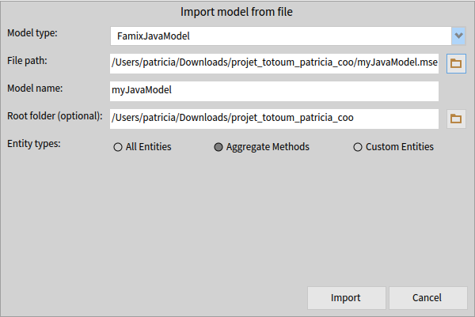
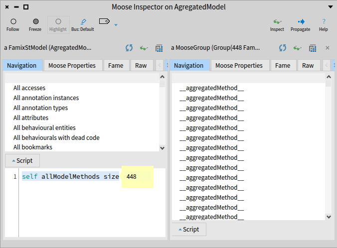

As software systems grow more complex, importing large models into Moose using the conventional process can cause issues with speed, excessive memory usage, and overall performance due to the vast amount of data. To ensure a smoother analysis process, managing the importation of extensive models efficiently is crucial. To overcome these challenges, strategic filtering and aggregation have emerged as powerful techniques.  

## Filtering entities: limits and approach

One feature of Moose is its model import filtering, which provides a practical approach to effectively handle large models.
It allows us to selectively choose relevant entities for analysis instead of importing the entire model.  
  
However, filtering has its limitations.
By excluding certain entities during importation, we may lose some fine-grained details that could potentially be relevant for certain analyses.
Moreover, if our filtering criteria are too aggressive, we might overlook important dependencies that could impact the overall understanding of the software system.
To address these limitations, we have adopted a specific approach in this context - not importing methods.

## Simplifying the model by not importing methods

let's take a look at a real-life example - a massive software model with over 130,000 methods!

  
  
While method-related information can be crucial for certain analysis tasks, focusing on high-level relationships between classes is often more important than diving into individual method implementations. By avoiding the importation of individual methods, we strike a balance between capturing essential dependency information and simplifying the model.  

But how do we preserve crucial dependency information when we're not importing methods? This is where aggregation comes into play.
  
## Aggregation: an approach to capture dependencies

Aggregation involves creating an aggregated method within each class, serving as a central repository for consolidating dependencies. This approach reduces the need for complex connections between individual methods, leading to improved performance and overall efficiency. The abstraction layer introduced by aggregated methods not only simplifies the model but also enhances its modularity. By adopting this approach, we promote cleaner code design, making the software more maintainable and adaptable.  
  
Now, let's explore the process of importing a software model into Moose using the aggregator approach.  
  
## Importing a model in Moose with the aggregator

To import an aggregated model into Moose:  

1. Open Moose's model browser.
2. Locate the model file on your computer.
3. Click "Aggregate Methods."
4. Click "Import."  
  
  
  
Now, the aggregated model is available for analysis in Moose.  
   
  

## Benchmarking aggregation's impact on model size and analysis

To assess the effectiveness of aggregation in reducing model complexity, we conducted a benchmark using a real-life example. The original software model had a staggering 10,267 methods.  

  

After importing the model into Moose using the aggregation approach, the corresponding aggregated model had only 448 methods. This showcases a substantial reduction in complexity achieved through aggregation.  

  
  
In proportion, the aggregated model represents just 4.4% of the original model's size (448 / 10,267 * 100). This remarkable decrease in the number of methods demonstrates the powerful impact of aggregation in simplifying the model.  
  
Our benchmark confirms that aggregation is an invaluable technique for managing large models in Moose. It significantly streamlines the analysis process while preserving essential dependency information. Aggregation empowers software engineers to work with large-scale systems more efficiently and promotes cleaner code design, making the software more maintainable and adaptable.  

## Conclusion

In summary, aggregation proved to be a highly effective approach for managing large models in Moose. By adopting aggregation, software engineers can work more efficiently with complex systems.
